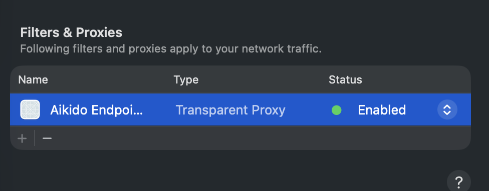

# Transparent Proxy

## MacOS

This chapter covers the macOS L4 transparent proxy packaging in this repository.
It is the developer-facing wrapper around the Rust transparent proxy extension and
is also the shape intended for future daemon or MDM-driven activation flows.

### Operating Model

The macOS transparent proxy consists of:

- a Rust static library: `proxy-lib-l4-macos`
- a Network Extension app extension embedded in a host app bundle
- a minimal host CLI that manages the `NETransparentProxyManager` profile

The host CLI does not need to remain running after `start`.
Once the profile is installed and the transparent proxy tunnel is started,
macOS manages the extension lifecycle.

The current host CLI exposes three commands:

- `start`
- `stop`
- `status`

`start` can also pass the opaque JSON config consumed by the Rust proxy runtime:

- `--reporting-endpoint URL`
- `--aikido-url URL`
- `--agent-token TOKEN`
- `--agent-device-id DEVICE_ID`
- `--use-vpn-shared-identity`
- `--reset-profile`

The `agent token` and `agent device id` map to the Rust-side `agent_identity`
payload expected by `proxy-lib-l4-macos/src/config.rs`.

## Stack Overview

```text
+------------------------------+
| Host CLI                     |
| main.swift                   |
| start / stop / status        |
+--------------+---------------+
               |
               | saves and starts
               v
+------------------------------+
| NETransparentProxyManager    |
| macOS-managed profile        |
+--------------+---------------+
               |
               | launches
               v
+------------------------------+
| Network Extension            |
| Extension/ + Rust staticlib  |
+--------------+---------------+
               |
               | FFI bridge
               v
+------------------------------+
| proxy-lib-l4-macos           |
| transparent proxy runtime    |
+--------------+---------------+
               |
               | provider APIs
               v
+------------------------------+
| rama ffi apple provider      |
| TcpFlow / NE integration     |
+--------------+---------------+
               |
               | proxy engine
               v
+------------------------------+
| rama + safechain_proxy_lib   |
| MITM / firewall / reporting  |
+------------------------------+
```

At a high level: Swift owns profile management, macOS owns extension lifecycle,
the Rust static library hosts the runtime, and Rama provides the Network Extension
FFI/provider surface plus the transparent proxy engine.

Relevant sources:

- Host CLI: [`packaging/macos/xcode/l4-proxy/Host/main.swift`](../../packaging/macos/xcode/l4-proxy/Host/main.swift)
- Xcode packaging (dev): [`packaging/macos/xcode/l4-proxy/Project.dev.yml`](../../packaging/macos/xcode/l4-proxy/Project.dev.yml)
- Xcode packaging (dist): [`packaging/macos/xcode/l4-proxy/Project.dist.yml`](../../packaging/macos/xcode/l4-proxy/Project.dist.yml)
- Rust entrypoint: [`proxy-lib-l4-macos/src/lib.rs`](../../proxy-lib-l4-macos/src/lib.rs)
- Rust TCP proxy service: [`proxy-lib-l4-macos/src/tcp.rs`](../../proxy-lib-l4-macos/src/tcp.rs)
- Rust config schema: [`proxy-lib-l4-macos/src/config.rs`](../../proxy-lib-l4-macos/src/config.rs)
- Rama transparent proxy guide: <https://ramaproxy.org/book/proxies/transparent.html>

### Relevant Files

- Rust transparent proxy library: `proxy-lib-l4-macos/`
- Xcode packaging: `packaging/macos/xcode/l4-proxy/` (Host+Extension)

### CA Modes

The macOS transparent proxy currently supports two CA sources.

#### CA Mode: Self-Managed CA

This mode, similar in capability to the L7 Proxy, attempts to load a self-signed
CA certificate and key from a fixed location in the Protected App storage (only accessible by the proxy).

If the CA does not exist (for example on first run), it will be generated automatically and stored in that location.
On subsequent starts, the proxy will reuse the existing CA.

This is the default mode and works well for:

- quickly building and testing the L4 proxy on a local machine
- non-MDM flows where the following dynamic process is acceptable:
  - during enrollment, installation, or first-time use, the proxy must be started first
  - the CA certificate can then be installed by retrieving it from the hijacked domain at `/data/root.ca.pem`
  - for Docker builds that run package managers during image build, install that CA
    into the image before the first package download; see `proxy/troubleshooting.md`
    for a concrete Dockerfile example

#### CA Mode: Managed VPN Shared Identity

This mode is designed specifically for MDM environments where a static root CA is required across an entire organisation.

In this setup, the proxy still uses its own CA, but instead of being self-signed, it acts as an intermediate CA signed by the organisation’s root CA.

The flow is roughly as follows:

1. A device is enrolled via an MDM solution (Device Management).
2. As part of enrollment, a SCEP profile is installed. This profile includes:
   - the SCEP server details (operated by Aikido or the organisation)
   - the identity (Apple Bundle ID) of the L4 Proxy
3. A new key and certificate are generated on the device. The certificate is sent to the SCEP server and returned after being signed by the organisation’s root CA.
4. The signed certificate and key are stored as a `SecIdentity` in the `com.apple.managed.vpn.shared` access group. This group is accessible to applications with the Network Extension entitlement. However, because the identity is scoped to the proxy, only the proxy can access it.
5. When the proxy is started with the `--use-vpn-shared-identity` CLI flag (on the host), it looks up the `SecIdentity` in this access group using its identity. Once found, it:
   - extracts the private key
   - copies the certificate
   - converts both into an in-memory representation compatible with the (rama) boring library

Steps 1 through 4 are performed only once during enrollment, or whenever the certificate and key need to be rotated.
Step 5 is executed every time the proxy (app extension) starts.

Current managed identity assumptions:

- the identity lookup is mode dependent (dev vs dist)
- the access group is hardcoded to `com.apple.managed.vpn.shared`
- the private key is assumed to be exportable (for example, allowed by the SCEP profile)

The latter is typically configurable as an option when creating the SCEP profile.
If exporting the private key is not allowed or not desirable, the codebase will need to be updated to support a (rama) boring(ssl) issuer that operates directly on the macOS `SecIdentity` via native APIs.

### Build And Install

The `Justfile` contains the supported developer commands.

Build with signing and install the app bundle into `/Applications`:

```bash
just macos-l4-install-signed
```

The install step also registers the embedded extension with `pluginkit`.

### Run As A Developer

Check current state:

```bash
just macos-l4-status
```

The current state of the proxy can also be seen in the
system settings of your MacOS machine, under Network,
you should see the Aikido Endpoint L4 Proxy listed
in the "Filters & Proxies" section with a status next to it
that says either "enabled" (green) or "disabled" (red).



Start the transparent proxy with defaults:

```bash
just macos-l4-start
```

Start the transparent proxy with explicit runtime config:

```bash
just macos-l4-start \
  --reporting-endpoint https://example.internal/reporting \
  --aikido-url https://app.aikido.dev \
  --agent-token YOUR_TOKEN \
  --agent-device-id YOUR_DEVICE_ID
```

Start the transparent proxy using the managed VPN shared identity:

```bash
just macos-l4-start --use-vpn-shared-identity
```

Stop the transparent proxy:

```bash
just macos-l4-stop
```

Install and immediately start it in one step:

```bash
just run-macos-l4-proxy
```

Reset the saved Network Extension profile before starting:

```bash
just macos-l4-start --reset-profile
```

### Logs

Stream live logs from the host and extension:

```bash
log stream --style compact --level debug \
--predicate 'subsystem == "com.aikido.endpoint.proxy.l4"
  OR process == "AikidoEndpointL4ProxyExtension"
  OR process == "Aikido Proxy"'
```

Show recent logs from the last 5 minutes:

```bash
log show --last 5m --style compact --debug --info \
--predicate 'subsystem == "com.aikido.endpoint.proxy.l4"
  OR process == "AikidoEndpointL4ProxyExtension"
  OR process == "Aikido Proxy"'
```

Export recent logs to a file for sharing or later analysis:

```bash
mkdir -p .aikido/logs
log show --last 30m --style compact --debug --info \
--predicate 'subsystem == "com.aikido.endpoint.proxy.l4"
  OR process == "AikidoEndpointL4ProxyExtension"
  OR process == "Aikido Proxy"' \
 > ".aikido/logs/aikido_l4_proxy_${ts}.log" 2>&1
```

>[!IMPORTANT]
> In order for `--debug` evens to persist you need to enable
> these via:
>
> ```bash
> sudo log config --mode "level:debug,persist:debug" \
>    --subsystem com.aikido.endpoint.proxy.l4
> ```
>
> Once you should see `DEBUG PERSIST_DEBUG` when running this command:
>
> ```bash
> sudo log config --status --subsystem com.aikido.endpoint.proxy.l4
> ```
>
> Do not do this on production systems, and where you do disable it again once no longer needed,
> using the command:
>
> ```bash
> sudo log config --mode "level:default,persist:default" \
>    --subsystem com.aikido.endpoint.proxy.l4
> ```
>

### Notes For Developers

- The host executable lives inside the installed app bundle at:
  `/Applications/Aikido Proxy.app/Contents/MacOS/Aikido Proxy`
- `status` reports the current Network Extension state and the saved JSON config, if any.
- The transparent proxy profile is persisted by `NETransparentProxyManager`.
- The extension is expected to be restarted by the system according to the saved profile state;
  the host CLI is a controller, not a long-running supervisor.
